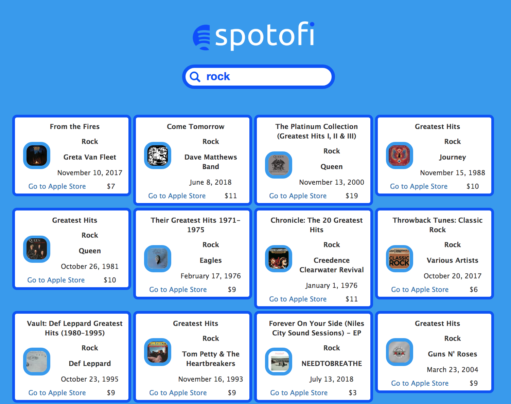

## Spotofi React app

### Project information
This app is for fictional company called Spotofi which consume itunes API 'Top 100' songs to render information on the screen. The main requirement is to create clean, readable, maintainable code and render [JSON feed data](https://itunes.apple.com/us/rss/topalbums/limit=100/json) to the screen.

### Instruction
- ```git clone``` the project repo
- ```yarn install``` to install all dependencies
- ```yarn start``` to kickstart FE application
- type in data into the search box, e.g. 1990, Pop, Mamma Mia - results will update on each keystroke

### Steps completed
- used functional and class React components, lifecycle method ***componentDidMount*** as well 
- used ***create-react-app** to scaffold application
- used ***node-sass-chokidar*** to transpile Sass to CSS on build, ***watch-css*** to transpile while developing
- clean, readable, maintainable code ...I hope ;)
- VCS with Git obviously ;)
- Up to 100 albums are being rendered depending on search query, a string must be included in JSON feed data
- imported search glyphicon
- App deloyed to Heroku

### To do / ideas
- toggle to sort results in ascending/descending order?
- toggle to render a grid of big images (album covers) only
- CSS animations?
- Bootstrap/Reactstrap for responsivness
- refactor search method to cleaner .some()

### Screenshot
[***Click here to see Spotofi app deployed to Heroku***](https://spotofi.herokuapp.com/)
